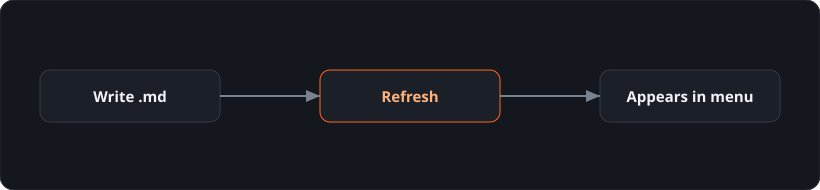

# Introduction

Welcome! This is a lightweight, dependency-free wiki. Everything you read is a plain Markdown file rendered in your browser — no build step, no database.

## What it's good for

Internal docs, runbooks, onboarding guides, course notes, a personal knowledge base — anything that fits a **Section → Group → Page** structure.

## How it works

1. You write Markdown files inside the `content/` folder.
2. The left menu is generated from your folders automatically.
3. Refresh the browser and your new page is there.

See **Setup & Installation** to run it, or open the **Authoring guide** (bottom of the sidebar) to learn the formatting.
